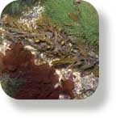
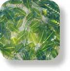

# Plants on This Site  
don't know the name of the plant? Try the [photo index of lifeforms](photoindex)   

# Intertidal and Marine Plants

  
All marine  **[seaweeds](plants/seaweed/seaweedindex)**

  
All marine  **[seagrasses](plants/seagrass/seagrassindex)**

  
**[mangroves and coastal](plants/plantindex)** trees and plants

[www.**flickr**.com](http://www.flickr.com)  

FREE photos from [wildsingapore](http://www.flickr.com/photos/54527470@N00).
Make your own badge [here](http://www.flickr.com/badge.gne).

Photo Index of Plants on This Site

[mangroves and coastal plants](plants/plantfi)
| [all seagrasses](plants/seagrass/seagrassfi)
| [all seaweeds](plants/seaweed/seaweedfi)